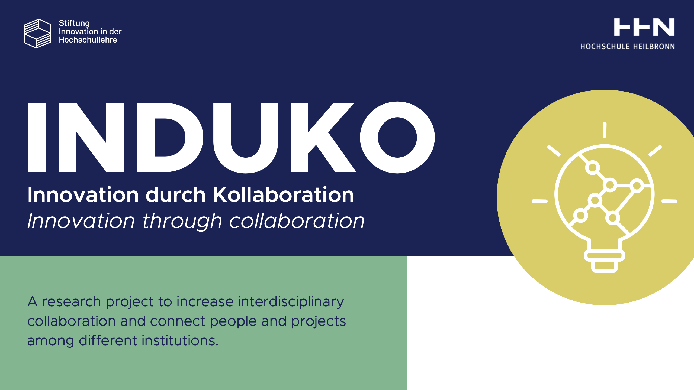

<p align="center">
  <a href="https://www.hs-heilbronn.de/de/induko" target="blank"></a>
</p>


# IdeaLize (Idea + reaLize): "Let ideas get realized!"

Heilbronn University is researching advanced technical tools and didactic approaches designed to foster collaboration and interaction. The primary goal is to enhance and facilitate interdisciplinary, inter-faculty, and inter-university cooperation. Through the InduKo research project, we aim to strengthen this collaboration using innovative digital tools and modern, digitally supported strategies that boost motivation and foster innovation through partnership. A key aspect of this effort is involving students directly in the development process. The IdeaLize platform, a sub-project within InduKo, is designed to showcase HHN's ideas and projects, helping to identify collaboration opportunities, share expertise, and encourage new perspectives. Students, professors, lecturers, and staff are invited to post projects, engage in discussions, and collaborate or offer support, fostering a community of shared knowledge. This platform facilitates sustainable project management and transparent knowledge transfer, providing a comprehensive portfolio of HHN initiatives. It inspires joint projects, potential start-ups, and a broad spectrum of exchanges across locations and faculties, empowering both students and faculty to connect and innovate together. InduKo Project was funded by Stiftung Innovation in der Hochschullehre (August 2021 - July 2024). Refrence
## Features

- Post and share projects within the university community.
- Facilitate interdisciplinary collaboration across faculties.
- Easy access to project discussions and knowledge sharing.
- Supports uploading of files, images, and other multimedia.
- Built using **GetX** for state management and routing, adhering to **clean architecture** principles.
  
## Technology Stack

- **Framework**: Flutter (v3.2.3+)
- **State Management**: GetX
- **Architecture**: Clean Architecture, Feature-Based Structure
- **Supported Platforms**: Android and iOS
- **Routing**: GetX Routing

## Dependencies

The following are key dependencies used in the project:

- `get`: ^4.6.6 (for state management and routing)
- `intl`: ^0.19.0 (for internationalization)
- `http`: ^1.1.2 (for handling HTTP requests)
- `flutter_secure_storage`: ^9.0.0 (for secure local storage)
- `flutter_svg`, `image_picker`, `overlay_support`, `dotted_border`, and more.

A full list of dependencies can be found in the [`pubspec.yaml`](pubspec.yaml) file.

## Installation

To run this project on your local machine, follow these steps:

1. **Install Flutter**:
    - Ensure you have Flutter SDK installed. If not, follow the [official installation guide](https://flutter.dev/docs/get-started/install) for your platform.

2. **Clone the Repository**:
    ```bash
    git clone https://github.com/yourusername/idealize_new_version.git
    ```

3. **Navigate to the Project Directory**:
    ```bash
    cd idealize_new_version
    ```

4. **Install Dependencies**:
    ```bash
    flutter pub get
    ```

5. **Run the Project**:
    For Android:
    ```bash
    flutter run
    ```
    For iOS (requires macOS and Xcode):
    ```bash
    flutter run
    ```

### Notes

- Ensure that your Flutter SDK is **v3.2.3 or above**.
- If you wish to update the base URLs for the backend, navigate to the file `Core/Constants/app_config.dart` and update the `baseURL` and `baseFileUrl` accordingly:

```dart
String get baseURL => "http://your-backend-url/api";
String get baseFileUrl => "https://your-file-url";
```

## Usage

Once the project is up and running, you will be able to:

1. **Post Projects**: Share project ideas and collaborate with other users.
2. **Browse Projects**: Explore projects posted by others, filtered by faculty and type.
3. **File Sharing**: Upload and manage files related to your projects.

## Project Structure

The project follows a **clean architecture** with a feature-based structure, ensuring scalability and maintainability. Key directories include:

- **Core**: Contains constants, configuration files, and general utilities.
- **Features**: All project-related features are divided into separate modules.
- **Routes**: Centralized routing handled by GetX.

## Contributing

Contributions are welcome! Please follow these steps to contribute:

1. Fork the repository.
2. Create a feature branch (`git checkout -b feature/AmazingFeature`).
3. Commit your changes (`git commit -m 'Add some AmazingFeature'`).
4. Push to the branch (`git push origin feature/AmazingFeature`).
5. Open a Pull Request.

## License

This project is licensed under the 

## Acknowledgments

This project was developed as part of the **InduKo Project**, funded by **Stiftung Innovation in der Hochschullehre**. We also acknowledge the support from students, faculty, and contributors who have been part of this collaborative effort.

For more information about the InduKo research project, visit the official website.


